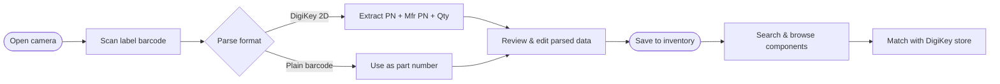
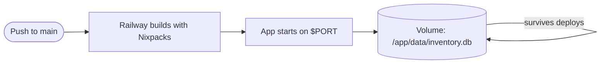

# inv2digikey

      

Mobile-friendly web app to scan QR codes and barcodes from electronic components, store inventory data, and match parts with DigiKey listings.

---

## Features

- **Barcode & QR Code scanning** — uses your device camera to scan DigiKey Data Matrix codes, QR codes, and standard barcodes
- **Auto-parsing** — extracts DigiKey PN, manufacturer PN, quantity, and description directly from scanned labels
- **Inventory management** — store, edit, and delete component entries with quantities and locations
- **Field-scoped search** — search by reference, manufacturer reference, description, manufacturer, or location (or all), driven by an explicit Search button so it stays comfortable to type on a phone
- **DigiKey integration** — stores DigiKey and manufacturer part numbers for easy cross-reference
- **Authentication** — username/password protected; first user registers freely, subsequent users require a setup token
- **Main menu** — single hub for every feature, reachable from the inventory header
- **Light / dark mode** — appearance toggle in Settings, remembered across sessions
- **Backup & restore** — download the whole inventory as JSON and re-import it (merge or replace)
- **CSV export** — download the inventory as a spreadsheet-friendly CSV
- **User management** — list, add, and remove users, and reset passwords, from within the app
- **About page** — shows the app version and developer
- **Mobile-first UI** — responsive design optimized for smartphone use in the field
- **Railway-ready** — deploys in one click with PostgreSQL add-on

---

## How it works



---

## Quick start

### Local development

```bash
# 1. Clone and install dependencies
git clone https://github.com/arananet/inv2digikey.git
cd inv2digikey
pip install -r requirements.txt

# 2. Configure environment
cp .env.example .env
# Edit .env: set SECRET_KEY and DATABASE_URL

# 3. Run the app
uvicorn main:app --reload

# 4. Open http://localhost:8000 — register your first user
```

### Run tests

```bash
pytest
```

---

## Deployment on Railway



### Step-by-step

**1. Create the Railway service**
- New project → Deploy from GitHub repo → select `arananet/inv2digikey`

**2. Add a persistent Volume** *(critical — do this before first use)*
- Service → **Volumes** tab → **Add Volume**
- Mount path: `/app/data`
- This directory survives every future deploy and restart. Without it the database resets on each deploy.

**3. Set environment variables**
- Service → **Variables** tab

| Variable | Required | How to get it |
|---|---|---|
| `SECRET_KEY` | **Yes** | Run `openssl rand -hex 32` in any terminal |
| `SETUP_TOKEN` | No | Any string — required to register a second user |

> `DATABASE_URL` is **not** needed. The app uses SQLite stored in the volume at `/app/data/inventory.db`.

**4. Deploy**
Railway auto-detects `railway.toml` and starts the app. First visit → register your account → start scanning.

---

## Environment variables

| Variable | Default | Description |
|---|---|---|
| `SECRET_KEY` | *(none)* | JWT signing secret — **set this** |
| `DB_DIR` | `./data` | Directory for `inventory.db`. Set to `/app/data` automatically when volume is mounted at that path |
| `SETUP_TOKEN` | *(none)* | If set, required to register users after the first account |

---

## Scanning distributor labels

The app auto-detects and parses three label families:

**DigiKey / Mouser** — a **2D Data Matrix** in the ISO/IEC 15434 format (GS/RS control characters):

- `K` / `P` prefix — distributor part number (e.g. `RHM33.0AFCT-ND`)
- `1P` prefix — manufacturer part number (e.g. `ESR18EZPF33R0`)
- `30P` prefix — quantity
- `1V` / `4V` prefix — manufacturer name

**TME (tme.eu)** — a plain-text **QR code** with space-separated `KEY:VALUE` tokens, e.g.
`QTY:5 PN:SN74LS125AD MFR:TEXASINSTRUMENTS MPN:SN74LS125AD PO:7910976/3 https://www.tme.eu/details/SN74LS125AD`:

- `QTY` — quantity
- `PN` — TME order symbol (used as the primary part number)
- `MPN` — manufacturer part number
- `MFR` — manufacturer name

**Plain barcodes** — any other Code 128 / EAN code; the raw value becomes the part number and you fill in the rest manually.

The label parser lives in `static/parser.js` and is covered by Node regression tests:

```bash
node tests/parser.test.mjs
```

---

## Project structure

```
inv2digikey/
├── main.py          # FastAPI app — all routes
├── models.py        # SQLAlchemy database models
├── database.py      # Database connection & session
├── auth.py          # JWT authentication helpers
├── schemas.py       # Pydantic request/response schemas
├── requirements.txt
├── Procfile         # Railway / Heroku start command
├── railway.json     # Railway deployment config
├── .env.example     # Environment variable template
├── static/
│   └── index.html   # Single-page application (vanilla JS + Tailwind)
└── tests/
    └── test_api.py  # Pytest API tests
```

---

## OpenSpec

Every feature in this repo is spec-driven. See `.openspec/specs/` for active specs.

```bash
# Install git hooks that enforce spec coverage on commit
bash setup.sh
```

---

**Developer:** Eduardo Arana  
**License:** [MIT](LICENSE)

---

[](https://ko-fi.com/H2H51MPWG)
